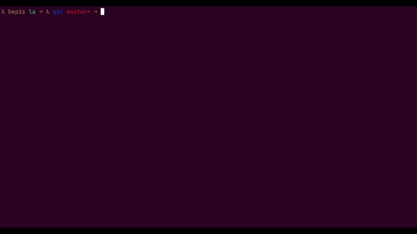

# Lucky Ant

Sometimes a cute ASCII ant run across your terminal when you type `la`, if you're lucky enough.

It's just a joke command, and not useful at all. Here's how it looks like:

<p align="center">
  
</p>

## Build
This project uses `curses.h` library, which you can install on Ubuntu by running:
```
sudo apt-get install libncurses5-dev libncursesw5-dev
```
To compile, run:
```
make clean && make
```


After compiling, if you want the command run _only sometimes_ when you type `la`,  
add this to your `.bashrc/.zshrc/.somethingelserc`:
```
unalias la                        # Unalias the usual la command
function la {
    if (( $RANDOM % 10 == 0 ));
    then
        ~/path_to_project/la
    else
        ls -lAh                   # "Re-alias" the unalised command
    fi
}
```
With this configuration, it runs with probability of `1/10`.

****************************************************************

Inspired by and forked from the cult classic `sl` by Toyoda Masashi (mtoyoda@acm.org)

This project is specifically created for a job application at AntColony.
